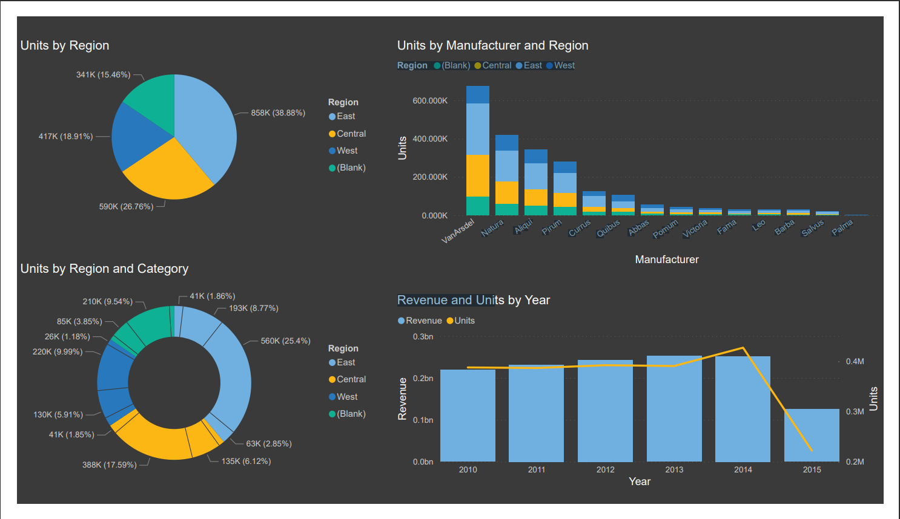

# Power BI Sales Dashboard 

## Overview

This Power BI Sales Dashboard is designed to provide a comprehensive view of our company's sales data, helping users make data-driven decisions. It presents key sales metrics, trends, and insights through interactive visualizations.

## Features

- **Sales Performance:** An overview of sales performance metrics, including total revenue, sales growth, and sales by region.
- **Product Analysis:** A breakdown of product sales by category and individual products, helping identify top-performing and underperforming items.
- **Geographical Insights:** Geospatial visualizations showing sales distribution by region, providing a regional sales perspective.
- **Time Analysis:** Time-based analysis, including sales trends over time, seasonality, and monthly, quarterly, and yearly comparisons.
- **Customer Segmentation:** Analysis of customer segments and their contribution to sales, enabling targeted marketing strategies.

## Getting Started

### Prerequisites

- [Power BI Desktop](https://powerbi.microsoft.com/en-us/desktop/)
- Sales data in a compatible format (e.g., CSV, Excel, SQL database)

### Installation and Usage

1. Download and install [Power BI Desktop](https://powerbi.microsoft.com/en-us/desktop/) if you haven't already.
2. Clone or download this repository.
3. Open the Power BI Sales Dashboard file (`.pbix`) in Power BI Desktop.
4. Connect your sales data source to the dashboard by following the prompts.
5. Customize the dashboard as needed, such as adjusting filters, adding new data sources, or modifying visuals.
6. Save and publish the dashboard to Power BI Service if you want to share it with a broader audience.

## Data Sources

- The dashboard is designed to work with sales data. Ensure that your data includes the necessary fields such as date, product, region, and sales amounts for accurate visualization.

## Customization

You can customize the dashboard to fit your specific needs:

- **Adding More Data:** You can add more data sources or tables to the existing data model to expand the analysis.
- **Modifying Visuals:** Customize visualizations, colors, and layouts as needed.

## Troubleshooting

If you encounter any issues with the dashboard or need assistance, please reach out to [Your Name/Email].

## Contributors

- [Your Name]: Dashboard development and data analysis.

## License

This project is licensed under the [Your License] License - see the [LICENSE.md](LICENSE.md) file for details.

## Acknowledgments

- Special thanks to the Power BI community for inspiration and resources.

Feel free to adapt this README to your specific dashboard's details, including data sources, visuals, and customizations. Make sure to provide clear instructions for users on how to set up and use the dashboard effectively.
